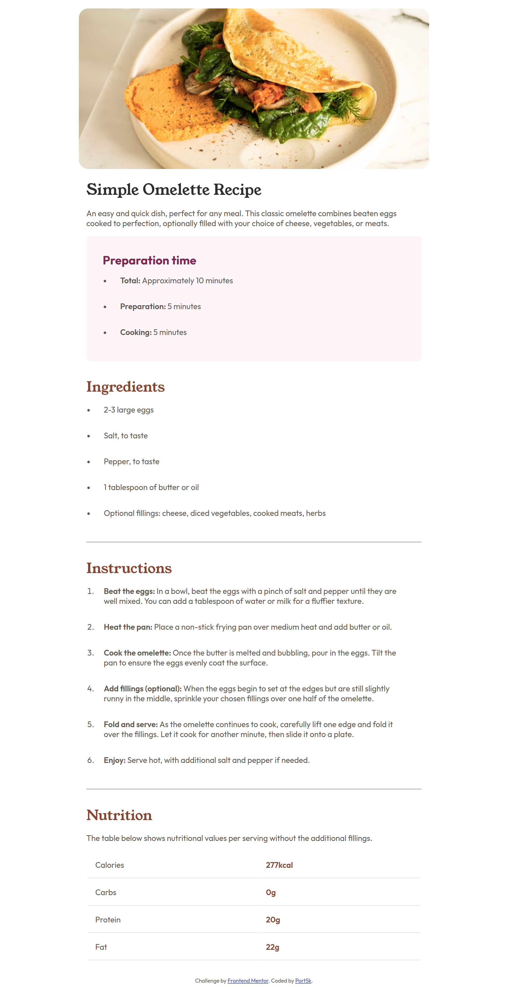

# Frontend Mentor - Recipe page solution

This is a solution to the [Recipe page challenge on Frontend Mentor](https://www.frontendmentor.io/challenges/recipe-page-KiTsR8QQKm). Frontend Mentor challenges help you improve your coding skills by building realistic projects.

## Table of contents

- [Overview](#overview)
  - [The challenge](#the-challenge)
  - [Screenshot](#screenshot)
  - [Links](#links)
  - [Built with](#built-with)
- [Author](#author)

## Overview

### Screenshot

### Links

- Solution URL: [Click to view the solution on Frontend Mentor](https://www.frontendmentor.io/solutions/recipe-page-OCzxuzJJXz)
- Live Site URL: [Click here to view the site live](https://adekunle6021023.github.io/fm-newbie-rpm/)

### Built with

- Semantic HTML5 markup
- CSS custom properties
- Flexbox

## Author

- My blog - https://adedokun.hashnode.dev
- Twitter - [@adedokun\_\_](https://www.twitter.com/adedokun__)
